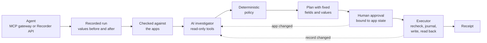

# Aftercare

When an AI agent fails partway through work across GitHub, Linear, and Slack, Aftercare works
out what went wrong, prepares a repair that keeps what people changed since, and applies it only
after a person approves.

**Try it live:** https://aftercare-ynmc.onrender.com. Choose **See it on sample data**; no accounts or
keys are needed. The AI investigator (`deepseek/deepseek-v4-flash`) is on there, so preparing a plan takes
about 15–30 seconds. The free instance sleeps when idle, so the first load can take about a minute.

**Demo video:** _(link to be added)_

[Try it without keys](#try-it-without-accounts-or-keys) · [How it works](#how-it-works) ·
[Evaluation](#evaluation) · [Judging criteria](#judging-criteria-and-evidence) ·
[Limitations](#limitations) · [Built before and during the event](#built-before-and-during-the-event)

## The problem

An onboarding agent creates a GitHub issue, but the response is lost, so it retries and creates a
duplicate. A stale roster makes it assign the Linear handoff to the wrong person. Then it tells
Slack that everything is done. By the time anyone notices, people have kept working on those records.

The obvious fixes fail:

- **Roll back**, and you overwrite what people changed after the agent.
- **Retry blindly**, and a write whose response was lost happens twice.
- **Trust the agent's report**, and you repair what it says it did rather than what it did.
- **Let a model fix it directly**, and one wrong judgment writes straight into your team's tools.

Recovering a partially completed workflow while preserving later human changes is an established
engineering problem. Microsoft's [Compensating Transaction pattern](https://learn.microsoft.com/en-us/azure/architecture/patterns/compensating-transaction)
describes it: you "can't always roll back the data because other concurrent application instances
might change the data," so the compensating transaction "must intelligently account for concurrent
work," and because compensation itself "can fail," the system "should record progress so that it
can resume."

Aftercare applies that pattern to records written by AI agents. Here the concurrent work is
people's, and choosing the compensation takes judgment: a second issue with the same title may be
a duplicate, or it may be distinct work. Whether teams will pay for Aftercare still needs customer
validation.

## How it works



1. **Capture.** Aftercare records each agent action with its values before and after. Agents
   connect through the [MCP gateway](#bring-your-own-agent), where Aftercare makes each call so the
   agent never holds an app token, or report their own calls through the Recorder API. When a run
   finishes, Aftercare reads every reported record back from the apps and refuses the whole run if
   anything differs ([server/external.ts:150](server/external.ts#L150)). A run that needs repair
   posts a Slack alert with a link to review it.
2. **Investigate.** A tool-calling model reads the journal and the current state of each affected
   record. For each one it chooses `close_duplicate` or `preserve_issue`, `restore_owner` or
   `preserve_owner`, and `append_correction` or `preserve_correction`, or it escalates the whole
   incident with the evidence gap ([server/investigator.ts:9](server/investigator.ts#L9)).
3. **Validate.** Deterministic policy refuses decisions without scoped evidence, closing an issue
   whose body changed, restoring an owner a person changed, and a second correction. Missing or
   conflicting provenance blocks any repair ([server/policy.ts:5](server/policy.ts#L5)). A
   rejected response gets corrective feedback within the same budgets.
4. **Compile.** Validated decisions become a plan with fixed fields and values. Aftercare, not the
   model, writes the Slack correction from the chosen outcomes
   ([server/recovery.ts:113](server/recovery.ts#L113)).
5. **Approve.** A person approves one plan version. Aftercare re-reads the apps first, and the
   approval is bound to a SHA-256 hash of the records, journal, and run, so any change makes the
   plan stale ([server/recovery.ts:64](server/recovery.ts#L64), [:177](server/recovery.ts#L177)).
6. **Execute.** Before each write, Aftercare re-reads every affected record from the apps, the
   write target last. It then saves the operation as running, writes, and reads the value back
   ([server/recovery.ts:250](server/recovery.ts#L250)). After an interruption it reconciles before
   anything else. If the app already shows the approved value, the operation is verified without
   writing again. If the app still shows the reviewed value, the write is retried after the
   checks. Otherwise the operation stops as uncertain ([server/recovery.ts:209](server/recovery.ts#L209)).
7. **Receipt.** The exported receipt holds the recorded run, journal, investigation, plan, observed
   app state, and every event.

### The pattern's requirements, and where Aftercare meets them

| The pattern says | Aftercare | Evidence |
| --- | --- | --- |
| "the compensating transaction must intelligently account for concurrent work" | Re-reads the apps before review, approval, and each write. A changed record makes the plan stale, and the next plan keeps the person's value ([recovery.ts:71](server/recovery.ts#L71), [:230](server/recovery.ts#L230)) | Seeded trials: human edit after review 50/50, during a repair 50/50. Live: a Linear reassignment during review was kept (September 12, observed by the operator); an issue edited during review stayed open (September 13, checked through GitHub's API) |
| "record progress so that it can resume the compensating transaction from the point of failure" | Each operation is saved as running before the app call and marked verified only after read-back; state survives a restart in `.data/` ([recovery.ts:255](server/recovery.ts#L255)) | Crash and restart 50/50 |
| "A step might run multiple times when retried, so design each step as an idempotent command" | An interrupted write is reconciled by reading the app before any retry; a second approve or execute joins nothing ([recovery.ts:204](server/recovery.ts#L204)) | Lost response 50/50; repeated approval and execution 50/50; live interruption: a single close event on the duplicate (September 12); 0 duplicate effects across 53 writes in real-model evaluations |
| "A step might not fail immediately but instead get blocked. You might need to implement a timeout mechanism." | 30-second timeout on app requests, with a stalled response reported as HTTP 504; 45 seconds per model request within a two-minute investigation ([providers.ts:26](server/providers.ts#L26), [investigator.ts:45](server/investigator.ts#L45)) | A stalled GitHub response found in a live run, then fixed ([VALIDATION.md](VALIDATION.md)) |
| "When decisions are high impact or hard to automate reliably, include a human in the decision-making process." | The model only recommends. A person approves one exact plan version against one exact app state ([recovery.ts:177](server/recovery.ts#L177)) | Stale-approval tests and the seeded trials above |
| "Sometimes manual intervention is the only way to recover from a failed step. In these situations, the system should raise an alert" | Conflicting provenance produces a durable escalation naming the gap; a write that can't be verified stops further writes; a run needing repair alerts Slack ([policy.ts:5](server/policy.ts#L5), [recovery.ts:225](server/recovery.ts#L225)) | Missing evidence 50/50; conflicting owners escalated in 3/3 development and 3/3 holdout trials |
| "ensure that you can correlate and audit both the original operation and its compensation end-to-end" | Each repair operation cites the recorded action it compensates, and the receipt holds both ([policy.ts:29](server/policy.ts#L29)) | Receipts from live runs ([VALIDATION.md](VALIDATION.md)) |
| "you can't safely or meaningfully undo some operations, such as external side effects" | Compensation doesn't pretend to undo: the duplicate is closed rather than deleted, and Slack gets a threaded correction while the original message stays unedited ([providers.ts:172](server/providers.ts#L172)) | Live runs, September 12–13 |

Quotes are from Microsoft's page, accessed September 13, 2026.

### Trust boundaries

**The AI investigator** can read the recorded run and the affected records, then submit decisions or
escalate. It can't approve, execute, choose a field or value, call an API, or read outside the
incident. Text inside app data is treated as data. It gets 8 rounds, 20 tool calls, 45 seconds per
request, and two minutes in total ([server/investigator.ts:45](server/investigator.ts#L45)).

**Outside agents** get four actions: create a GitHub issue, create a Linear issue, change a Linear
assignee, and post to Slack. Those actions are limited to the connected repository, team, and
channel ([server/mcp.ts:16](server/mcp.ts#L16)). Keys are `aft_` followed by 32 random bytes, and
Aftercare keeps only their SHA-256 hash, in memory. It accepts a key only in the `Authorization`
header, and keys can be revoked ([server/sessions.ts:55](server/sessions.ts#L55)). A run holds at
most 20 actions, and a workspace allows 120 agent requests a minute. Control characters are refused,
Aftercare writes the action summaries itself, Slack text is escaped, and requests from other
origins are refused.

**Hosted visitors** each get a separate workspace, and their tokens stay in server memory. The
operator's tokens are never used for visitors, and AI is off unless the operator turns it on.
Unknown Host headers get HTTP 421, and pages can't be framed
([server/index.ts:55](server/index.ts#L55)). A security review reproduced and fixed five findings
([VALIDATION.md](VALIDATION.md#security-review-september-12-2026)).

## Evaluation

Each layer is reported separately with its actual denominators, and failures and baselines are kept.

| Layer | What it measures | Result |
| --- | --- | --- |
| [Seeded recovery-engine trials](EVALUATION.md) | 9 failure scenarios against simulated GitHub, Linear, and Slack APIs that also hold unrelated records. Each trial is scored by final app state and the requests the apps handled, never by Aftercare's own claims | **450/450** (50 per scenario) |
| [Real-model investigator, development](EVALUATION-MODEL.md) | `deepseek/deepseek-v4-flash`, 9 cases × 3 trials, on simulated app state | **27/27**; the first run scored 8/27 and is [kept](EVALUATION-MODEL-BASELINE.md) |
| [Frozen holdout v1](EVALUATION-HOLDOUT.md) | 4 new cases, frozen with hashes of the cases, scorer, and implementation before a single model run | **10/12**; both failures were safe |
| [Frozen holdout v2](EVALUATION-HOLDOUT-V2.md) | 5 more new cases, frozen the same way after one v1 failure was fixed, then run once | **15/15** |
| [Live accounts](VALIDATION.md) | Real GitHub, Linear, and Slack accounts, with GitHub checked independently through its public API | Acceptance cases 1–4 of 5 passed; the recorded agent's run and AI-investigated repair passed |
| Regression tests | Engine, investigator, provider clients, sessions, HTTP, and outside agents; browser workflow on desktop and mobile | **81/81** tests; **2/2** browser workflows |

What the evaluation caught:

- **Partial outage, 0/25 on the first harness run.** A write the app refused left the plan uncertain
  permanently. The write is now retried when the app still shows the reviewed value, and the
  scenario passes 50/50.
- **Hostile content, 12/25.** Linear member names reached Slack unescaped. They're escaped now, and
  the scenario passes 50/50.
- **Holdout v1 failures, kept as failures.** Once the model kept a true duplicate open, which was
  safe (2 writes instead of 3). Once it asked to read a record outside the incident, which ended the
  investigation. Such a read now gets corrective feedback instead. v1 was not rerun: five new cases
  were frozen with that change and run once as holdout v2, which passed 15/15. That run doesn't record
  which records the model asked for, so a regression test covers the refusal itself.
- **Live runs found five problems,** including Linear's AI agent listed as a user and a GitHub
  response that stalled. All five were fixed ([VALIDATION.md](VALIDATION.md#first-live-run-september-12-2026)).
- **The hosted AI investigator failed in one of its first two live attempts.** The model provider
  returned malformed JSON for `submit_repair`, which ended the investigation, and six local trials
  reproduced it once. Such calls now get corrective feedback. Six more trials all completed, two of
  them after recovering from a malformed call ([VALIDATION.md](VALIDATION.md#hosted-deployment-on-render-september-13-2026)).

## Judging criteria and evidence

| Criterion | Evidence |
| --- | --- |
| Technical execution (30%) | The capture, investigate, validate, approve, and execute pipeline above; GitHub REST, Linear GraphQL, and Slack Web API clients used against real accounts; an MCP gateway (JSON-RPC over streamable HTTP) and a Recorder API for outside agents; isolated per-visitor hosted mode. TypeScript end to end: an Express server, a React client, and shared types |
| Reliability & evaluation (25%) | 450/450 seeded trials scored by app state; 27/27 real-model development trials with the 8/27 baseline kept; a 10/12 frozen holdout with both failures kept, then a fix and a new 15/15 frozen holdout; live acceptance cases 1–4 of 5 passed; 81 tests and 2 browser workflows; defects the evaluation found were fixed and given regression tests |
| Usefulness (20%) | For teams whose agents write to shared tools. Connect an agent through MCP, watch its actions live, get a Slack alert when a run needs repair, approve a repair that keeps people's changes, and keep a receipt. The built-in agent's full loop ran on real accounts. Willingness to pay is not yet validated |
| Originality (15%) | Compensating transactions for agent-written SaaS records, where choosing the compensation needs judgment. The model chooses among bounded repairs or preservation, and deterministic policy plus a human approval bound to app state gate that choice. The gateway both limits an agent's reach and checks its reported work against the apps. Public documentation reviewed on September 9 didn't describe this combination ([BUILD.md](BUILD.md#research-checked-september-9-2026)); that shows distinct positioning, not proof that nobody has built it privately |
| Demo clarity (10%) | Sample data that needs no keys, with a welcome screen; incident variants for distinct work, conflicting owners, and an existing correction; an in-app Evaluation view; a [two-minute script](DEMO.md); the video above |

## Try it without accounts or keys

```sh
npm install
npm test                        # 81 tests
npm run eval                    # 9 failure scenarios × 25 seeded trials
npm run eval:holdout -- --mock  # checks the frozen holdout's scorer; no model calls
npm run dev                     # then open http://127.0.0.1:4310
```

After `npm install`, each of the three checks finished in under a second on a laptop.

In the app, choose **See it on sample data**, then:

1. Prepare the repair. Each proposed change links to its evidence.
2. **Simulate a human edit.** Approval is now blocked.
3. **Review updated plan.** The new plan keeps the person's change.
4. Tick **Interrupt after the first write**, approve, and choose **Apply approved repair**.
5. **Reconcile & resume.** Aftercare reads the write back and doesn't repeat it.
6. **Export recovery receipt**, then open **Evaluation**.

Before preparing, use **Explore a different incident** to try distinct work, conflicting owners, or
an existing correction. Without an OpenRouter key, the app uses scenario rules and labels them as
such; they check structure only and don't judge meaning.

To check the build and browser workflows:

```sh
npm run build
npx playwright install chromium
npm run test:ui
```

## AI investigation

Add `OPENROUTER_API_KEY` to the ignored local `.env` file and restart the server. You can set
`OPENROUTER_MODEL` to a provider/model ID that supports function tools; the evaluations used
`deepseek/deepseek-v4-flash`. OpenRouter rejects a blank value, so either set one or leave the
variable out. The key stays on the server. Automated regression tests use stubbed responses, and
real-model results are reported separately under [Evaluation](#evaluation).

## Connect real apps

Aftercare can repair real GitHub, Linear, and Slack records in free accounts you control. Use
dedicated demo resources, because every connection creates records in them.

1. **GitHub:** create a repository such as `aftercare-demo`. Create a fine-grained
   personal access token limited to that repository with **Issues: Read and write**.
2. **Linear:** in a free workspace, create a personal API key in Linear's settings.
   A workspace with a single member works; the demo then removes the assignee
   instead of changing it.
3. **Slack:** in a free workspace, create an app at https://api.slack.com/apps with
   the bot scopes `chat:write`, `channels:read`, `channels:join`, and
   `channels:history`, install it, and copy the `xoxb-` bot token. Create a public
   channel such as `#customer-onboarding`.

Paste each token into **Connect your apps** and choose a repository, team, and channel; Aftercare
joins the channel for you. On your own machine you can instead set the six `AFTERCARE_*` values
from `.env.example` in the ignored local `.env` and restart (invite the app to the channel
yourself). The names are prefixed so a broad `GITHUB_TOKEN` or `SLACK_BOT_TOKEN` in your shell is
never used. Scenario-only runs, including the test suites, never connect to real apps.

**Run onboarding-agent in my apps** checks access with reads, then runs a demonstration agent
through Aftercare's recorder. Intake creates the Linear handoff issue. The agent creates the GitHub
issue, but the response is lost, so it retries and creates a duplicate. A stale roster makes it
reassign the handoff, or remove the owner in a one-person workspace, and it then announces
completion in Slack. The **Agent run** tab shows every call with its values before and after and
marks the three changes that need repair. After approval, the repair closes the duplicate, restores
the original assignee, and replies in the Slack thread. To test a human edit, change the assignee
directly in Linear after reviewing the plan. Reset returns to the local scenario; records created in
the apps stay there.

When the run finishes with problems, Aftercare posts an alert to the chosen Slack channel listing
them, with a link to review the repair. Recorded text in the alert is escaped so it can't mention
the channel or add links. The link is built from the server's configured address without any session
identifier, so forwarding it grants no access. If the alert fails, Activity reports it and the run
stays intact.

## Bring your own agent

Record an outside agent's work with a workspace **agent key** from the **Bring your own agent**
panel. The key is shown once and kept only as a hash in server memory. Aftercare accepts it only in
the `Authorization: Bearer` header, you can revoke it, and a restart invalidates it.

**MCP gateway** (`POST /mcp`, streamable HTTP with JSON responses). The agent calls `start_run`,
then `github_create_issue`, `linear_create_issue`, `linear_update_assignee`, and
`slack_post_message`, then `finish_run`. Aftercare makes each call with the workspace's own
connections, so the agent never holds an app token.

```sh
claude mcp add --transport http aftercare http://127.0.0.1:4310/mcp --header "Authorization: Bearer aft_..."
AFTERCARE_AGENT_KEY=aft_... npm run agent:example -- "Owner name"   # a deliberately faulty example agent
```

**Recorder API.** The agent makes its own calls and reports them:

- `POST /api/agent/runs` with `{ agent, task, owner }`
- `POST /api/agent/runs/current/actions` with one of `github.create_issue { issue, title, body, outcome }`,
  `linear.create_issue { issue, title, assignee }`, `linear.update_assignee { issue, before, after }`,
  or `slack.post_message { ts, text }`
- `POST /api/agent/runs/current/finish`, or `/discard`

When a run finishes, Aftercare reads every reported record back from the apps and refuses the whole
run if anything differs. A run matching the supported onboarding incident (a repeated create, a
wrong owner, and a premature announcement) opens in the normal investigation, approval, repair, and
receipt flow, and sends the Slack alert. Other runs are recorded and assessed but can't be repaired
yet. The safeguards are listed under [Trust boundaries](#trust-boundaries). Both interfaces are
covered by offline tests and were smoke-tested over local HTTP with the example agent; neither has
yet run against real accounts.

## Evaluate

```sh
npm run eval                          # 25 seeded trials per scenario
npm run eval -- --trials 50 --write   # updates EVALUATION.md and eval/results.json
npm run eval:agent -- --mode mock --trials 3 --write  # scripted harness control
npm run eval:agent -- --mode model --trials 3 --write # real OpenRouter calls; simulated app state
npm run eval:holdout -- --mock        # frozen holdout scorer check; no model calls
```

The engine suite runs the recorded agent and a repair through nine scenarios: a correct repair,
human edits after review and during a repair, a crash and restart, a lost response, a partial
outage, hostile content, repeated requests, and missing evidence. No model is called.

The investigator suite runs nine cases: normal recovery, a later human edit, lost responses, missing
evidence, malicious source content, distinct work, conflicting ownership, an accurate existing
correction, and a conflicting correction. `--mode model` uses the configured OpenRouter key, costs
inference, and sends only synthetic fixtures; it never loads app connections. A terminal policy
rejection counts as a failed trial even when it prevents an unsafe write. Rejected intermediate
responses are counted separately. The [scripted control](EVALUATION-MOCK.md) tests the harness, not
the model.

Frozen holdouts refuse to run again. v1's one run is in [EVALUATION-HOLDOUT.md](EVALUATION-HOLDOUT.md)
and v2's is in [EVALUATION-HOLDOUT-V2.md](EVALUATION-HOLDOUT-V2.md); check v2's scorer with
`npm run eval:holdout -- --mock --suite=eval/holdout-v2`.

## Let others try it

Set `AFTERCARE_PUBLIC_URL` to the address people will open, for example
`https://aftercare.example.com`, then build and start. On Render, the service's own address
(`RENDER_EXTERNAL_URL`) is used when `AFTERCARE_PUBLIC_URL` isn't set.

```sh
npm ci && npm run build
npm start
```

With a public URL, Aftercare:

- gives every visitor a separate workspace, tied to a session cookie that expires
  after 12 idle hours;
- ignores the operator's `AFTERCARE_*` tokens and Arga configuration, so visitors
  reach only the apps they connect themselves;
- keeps visitors' tokens in server memory only, so a restart asks them to reconnect;
- turns AI investigation off unless `AFTERCARE_HOSTED_AI=1`, so visitors cannot spend
  the operator's OpenRouter key by default;
- refuses to start without the production build, and answers only requests addressed
  to the public host name (add others, such as a health check host, to
  `AFTERCARE_ALLOWED_HOSTS`);
- listens on `0.0.0.0` and `PORT` unless `HOST` is set.

Each visitor needs their own GitHub token, Linear key, and Slack bot token, created as
described above. The Slack app must be one they create in their own workspace: Slack
limits thread reads to one per minute for apps installed in other workspaces outside
its Marketplace, and the repair's checks read the thread more often than that.

There are no accounts or sign-in, and at most 200 sessions stay active. If you set
`AFTERCARE_HOSTED_AI=1`, anyone with the link can run investigations on your
OpenRouter key, so use a key with a spending limit.

### Deploy on Render

This repository includes a Render Blueprint, [`render.yaml`](render.yaml). In Render, choose
**New → Blueprint**, connect this GitHub repository, and apply it. That creates one free web service
that builds with `npm ci --include=dev && npm run build`, starts with `npm start`, and runs as a
hosted instance at its `onrender.com` address. AI investigation stays off until you add
`OPENROUTER_API_KEY` and `AFTERCARE_HOSTED_AI=1` under **Environment**. Free instances sleep after
15 minutes without traffic and take about a minute to wake; a restart loses visitors' workspaces,
tokens, and agent keys.

## Arga twins (optional)

Repairs can also run against provisioned Arga twins, which need available Arga validation runs;
connecting real apps does not. With an MCP credential (`ARGA_MCP_URL` and `ARGA_MCP_AUTHORIZATION`,
or the `arga-context` entry in the operator's local Codex configuration) and no live apps connected,
the UI offers **Provision twins**. That requests one twin run per provider, recreates the failed
onboarding in them, and applies the same refresh, per-write checks, and read-back as live apps.
Provider tokens can be set with `ARGA_GITHUB_TOKEN`, `ARGA_LINEAR_TOKEN`, and `ARGA_SLACK_TOKEN`.
An expired twin refuses writes instead of falling back to the simulation. These adapters are tested
offline only: provisioning was blocked by Arga account quota on September 9, 2026 (see
[VALIDATION.md](VALIDATION.md#live-arga-attempt-blocked-before-provisioning)).

## Limitations

- **One supported incident.** Aftercare repairs a repeated create, a wrong owner, and a premature
  announcement across GitHub, Linear, and Slack. Other outside-agent runs are recorded and checked
  but not repairable. Compensation logic is application-specific, as the pattern itself notes.
- **No atomic compare-and-update.** Providers don't offer it here, so an edit between the final read
  and a write can still be overwritten. Reading the write target last narrows that gap but doesn't
  close it.
- **Compensation can't retract what happened.** Notifications that were sent and messages people
  already read stay that way.
- **Small evaluation sets.** Model judgment was measured on small authored sets from one workflow
  family: the 27 development trials reused cases while the investigator was being improved, and the
  two holdouts are 4 and 5 cases, 3 trials each. The malformed-argument fix came after holdout v2,
  and no frozen holdout covers it. The policy is not a semantic oracle, and GitHub comments and
  attachments aren't analyzed.
- **Simulated app state in the harness.** Simulated evaluations use in-memory apps with the real
  APIs' request and response shapes. Four of the five live acceptance cases are recorded as passed.
- **Outside-agent interfaces are untested on real accounts.** The MCP gateway and Recorder API have
  run offline and over local HTTP only, with the example agent as the only tested client.
- **Single server process.** Agent keys, hosted visitors' tokens, and the execution lock live in one
  process's memory. A restart invalidates keys and asks visitors to reconnect. There are no user
  accounts or production authorization.
- **No customer validation yet.** Willingness to pay and adoption are still unknown.

## Built before and during the event

Aftercare was started before the event, and its git history is the record. The first commit is from
September 9, 2026. Everything through commit `45353f0` (8:49 AM Pacific on September 13) predates
the 9:00 AM opening. That covers the recovery engine, the live app clients, hosted mode and its
security fixes, the AI investigator, the evaluations, and the frozen holdout.

Built at the event, starting at 9:22 AM Pacific:

- the MCP gateway and the Recorder API;
- workspace agent keys;
- the **Bring your own agent** panel;
- the example MCP agent and the tests for all of the above (commits `37d8c50` and `e5ab8a2`);
- this README's judge-facing sections;
- the fix that lets an investigation continue after an out-of-scope read, and frozen holdout v2
  (commits `ab44e49` and `df8310e`);
- the Render deployment, and corrective feedback for malformed tool arguments, a problem found on
  the live site.

## More detail

- [SYSTEM.md](SYSTEM.md): architecture and reliability brief
- [VALIDATION.md](VALIDATION.md): live-account runs, security review, and the problems found
- [EVALUATION.md](EVALUATION.md), [EVALUATION-MODEL.md](EVALUATION-MODEL.md),
  [EVALUATION-HOLDOUT.md](EVALUATION-HOLDOUT.md), [EVALUATION-HOLDOUT-V2.md](EVALUATION-HOLDOUT-V2.md): evaluation results
- [DEMO.md](DEMO.md): two-minute demonstration script and local walkthrough recording
- [BUILD.md](BUILD.md): product decisions, research, and acceptance cases
